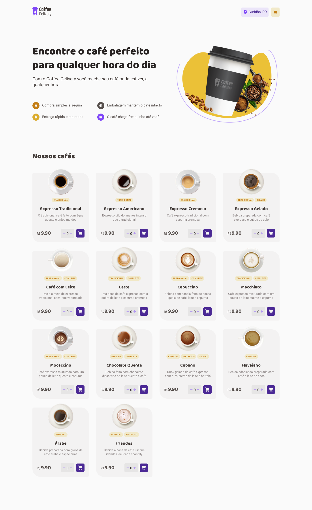
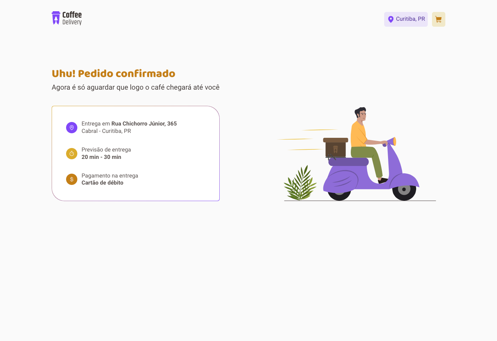

<p align="center">
  
</p>

<p align="center">
    <strong>Coffee Delivery Web Application</strong>
</p>

<p align="center">
 <a href="#-about">About</a> •
 <a href="#-features">Features</a> • 
 <a href="#-layout">Layout</a> • 
 <a href="#-technologies">Technologies</a> • 
 <a href="#-install">Install</a> • 
</p>

## 💻 About

The App was created to solve the challenge of Rocketseat's Ignite course (updated trail). This application, despite being simple, is an excellent example to practice the development of Shopping Cart manager.

<p align="center">
  
</p>

<p align="center">
  
</p>


## ☑ Features

- [x] List of products (coffees) available for purchase
- [x] Add a specific number of items to the cart
- [x] Increase or remove the number of items in the cart
- [x] Form for the user to fill in their address
- [x] Display the total items in the cart in the Header
- [x] Display the total value of the sum of items in the cart multiplied by the value

## 🎨 Layout

> Check Figma [Figma](https://www.figma.com/file/nQKy2XxgjHR4g0JZGUHcCC/Coffee-Delivery-%E2%80%A2-Desafio-React-(Copy)?type=design&node-id=222%3A824&mode=design&t=ecVLUijfiUtqwWNs-1)

### Home

<p align="left"> 
  
</p>

### Checkout

<p align="left">       
  
</p>

### Success

<p align="left"> 
  
</p>

## 🔨 Technologies

The following tools were used to build the project:

- **[ReactJS](https://reactjs.org/)**
- **[TypeScript](https://www.typescriptlang.org/)**
- **[Styled Components](https://styled-components.com/docs)**
- **[Vite](https://vitejs.dev/)**

> Check file [package.json](https://github.com/ghiberti85/ignite-coffee-delivery/blob/main/package.json)


## 🚀 Install

```bash
# Cloning repository
git clone https://github.com/ghiberti85/ignite-coffee-delivery.git

# Access project's folder
cd ignite-coffee-delivery

# Install dependencies
npm i

# Run application
npm run dev

```

---

Made with 💜 by [Fernando Ghiberti](https://github.com/ghiberti85)